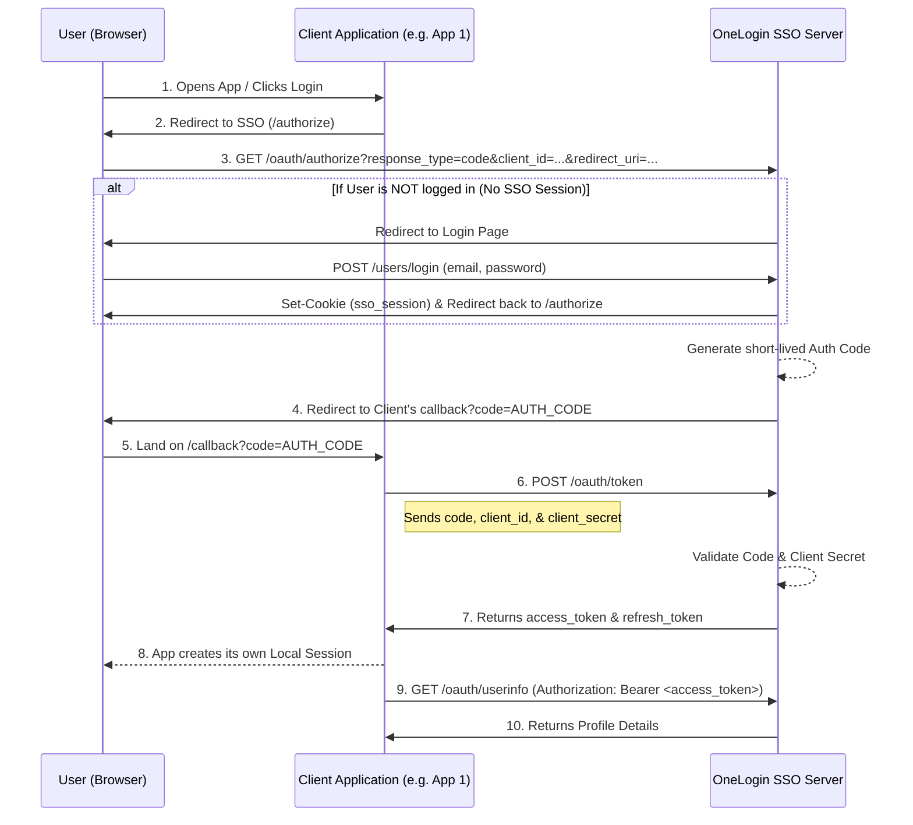

# OneLogin - SSO Authorization Server

**OneLogin** is a centralized Identity Provider (SSO Server) built on Node.js, Express, and MongoDB. It allows multiple external applications (Clients) to securely authenticate users through a centralized system using the **OAuth2 Authorization Code Flow**.

## 🚀 Key Features

- **Centralized Authentication**: Sign in once, access multiple configured applications.
- **OAuth2 Compliant**: Implements the Authorization Code Flow.
- **Microservice Ready**: Issues standard JWT Access Tokens for decoupled Backend-to-Backend authorization.
- **Developer API**: Endpoints to manage Apps/Clients, Tokens, and Users.

---

## 🏗️ Architecture & SSO Workflow

The Single Sign-On flow relies on a central interaction between the User (Browser), the Client Application, and the OneLogin SSO Server.



---

## 📚 API Documentation

### 1. Register Client (Admin)
Registers a new Client Application that can use the SSO service.
**Endpoint**: `POST /oauth/register-client`
**Headers**: `x-admin-secret: <your_admin_secret>`
**Request Body**:
```json
{
  "app_name": "My App 1",
  "redirect_uris": ["http://localhost:3000/callback"],
  "allowed_scopes": ["read_user"]
}
```
**Response (201 Created)**:
```json
{
  "client_id": "8b9e...f1b",
  "client_secret": "e2a...c8c",
  "app_name": "My App 1",
  "redirect_uris": ["http://localhost:3000/callback"],
  "allowed_scopes": ["read_user"]
}
```

---

### 2. User Login
Authenticates the user and sets an `HttpOnly` Secure cookie containing the SSO Session.
**Endpoint**: `POST /users/login`
**Request Body**:
```json
{
  "email": "user@example.com",
  "password": "mypassword123"
}
```
**Response (200 OK)**: Includes `Set-Cookie: sso_session=...`
```json
{
  "message": "User logged in successfully",
  "user": {
    "_id": "60d...1f",
    "email": "user@example.com",
    "name": "John Doe"
  },
  "token": "eyJhb..."
}
```

---

### 3. Authorize
Initiates the OAuth2 Authorization flow. It checks if the user has an active SSO Session cookie. If valid, it redirects back to the client with an Auth Code. If invalid, it redirects the user to the Login page.
**Endpoint**: `GET /oauth/authorize`
**Query Parameters**:
- `response_type=code` (Required)
- `client_id` (Required)
- `redirect_uri` (Required)
- `scope` (Optional)

**Response (302 Redirect)**:
`Location: http://localhost:3000/callback?code=AUTH_CODE_HERE`

---

### 4. Exchange Token
Exchanges the short-lived Authorization Code for Access and Refresh Tokens. *This call must be made Backend-to-Backend.*
**Endpoint**: `POST /oauth/token`
**Request Body**:
```json
{
  "grant_type": "authorization_code",
  "client_id": "<client_id>",
  "client_secret": "<client_secret>",
  "redirect_uri": "http://localhost:3000/callback",
  "code": "<AUTH_CODE_HERE>"
}
```
**Response (200 OK)**:
```json
{
  "access_token": "eyJhb...JWT...",
  "token_type": "Bearer",
  "expires_in": 900,
  "refresh_token": "a1b2c3d4e5f6..."
}
```

---

### 5. Refresh Token
Exchanges a valid Refresh Token for a new pair of Access and Refresh tokens.
**Endpoint**: `POST /oauth/token`
**Request Body**:
```json
{
  "grant_type": "refresh_token",
  "client_id": "<client_id>",
  "refresh_token": "<refresh_token_here>"
}
```

---

### 6. Get User Info
Fetches user details using a valid Access Token.
**Endpoint**: `GET /oauth/userinfo`
**Headers**: `Authorization: Bearer <access_token>`
**Response (200 OK)**:
```json
{
  "sub": "60d...1f",
  "name": "John Doe",
  "email": "user@example.com",
  "picture": "url_to_image",
  "email_verified": true
}
```

---

### 7. Revoke Token
Revokes/invalidates an Access or Refresh token.
**Endpoint**: `POST /oauth/revoke-token`
**Request Body**:
```json
{
  "token": "<access_token_or_refresh_token>",
  "token_type_hint": "access_token" 
}
```
**Response (200 OK)**:
```json
{
  "message": "Token revoked"
}
```

---

## 🛠️ Folder Structure Reference
```
OneLogin/
├── app.js                       # Main application entry point
├── src/
│   ├── config.js                # Environment configs / App wide constants
│   ├── controllers/             # Request handlers (auth, oauth, projects, etc)
│   ├── database/                # Database connections (Mongoose, Firebase)
│   ├── middlewares/             # Custom Express Middlewares (UserAuth, OAuthAuth)
│   ├── model/                   # Mongoose Schemas (User, OAuthClient, OAuthSession, etc)
│   ├── routes/                  # Express Route definitions
│   ├── services/                # Business logic and external integration layer
│   └── utils/                   # Helpers (StringFormatter, Validators)
└── .env                         # Environment Variables
```

## 💻 Tech Stack
- Node.js & Express.js
- MongoDB & Mongoose
- JSON Web Tokens (JWT)
- bcrypt (Password Hashing)
- Docker (Local Development Environment)
